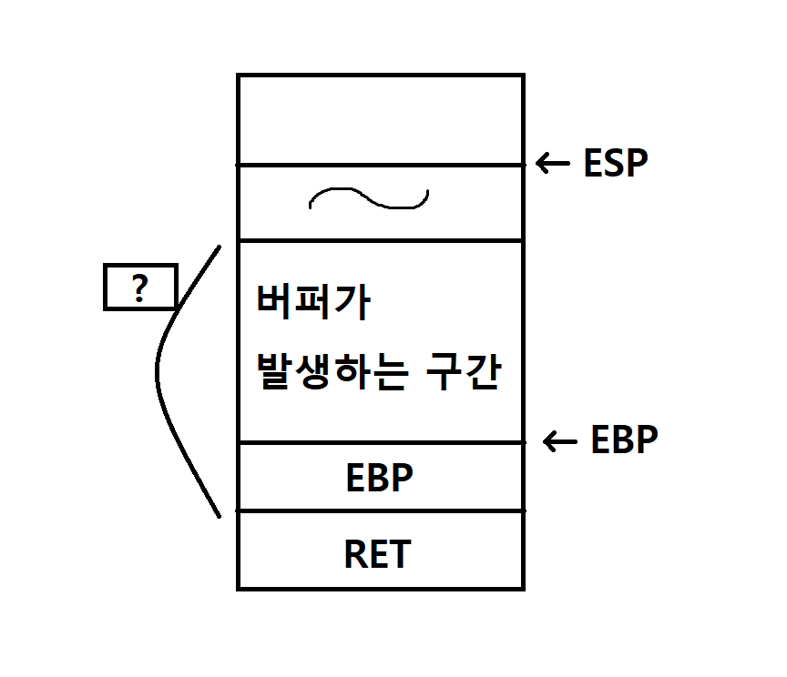

Day1 Homework
=============

## CWE(Common Weakness Enumeration)
--------
- CWE의 약자로 직역한다면 일반적인 약점 열거이다.
- 소프트웨어 보안 취약점들을 분류해 놓았다는 것을 의미하고 https://cwe.mitre.org/ <- 사이트에서 CWE들을 확인 할 수 있다.

- CWE와 CVE
    - 둘을 구분해보자면 약점(weaknesses)와 취약점(vulnerabilites)의 차이점이다. 

    - 약점은 '공격에 활용될 여지가 있는 오류'를 의미하고 취약점은 '실제로 공격을 할 수 있도록 구현이 가능한 오류'를 말한다.

    - 쉽게 말해 약점은 이론상 존재하는 위험 요소이고, 취약점은 실제적으로 공격이 가능한 것이다.

    - 약점은 취약점으로 이어질 수 있다.
    
    - > 참고 : https://scribnote5.github.io/cwe/static%20test/CWE658-1/

CWE사이트에 들어가면 탭에 CWE List 라는 메뉴가 보인다. 눌러보고 스크롤을 내려보니 Helpful Views부분에서 Software Written in C라는 메뉴가 보인다. 나에게는 아직 익숙한 것이 C밖에 없었고 어려운 영어 속에서 반가운 기분이 들었고 자연스럽게 클릭을 해보게 되었다. 클릭을 해보니 무언가 쫘르륵 CWE들이 나열되어 있다. 그 중 또 나에게 익숙하게 보이는 용어는 버퍼 오버 플로우였다.

---


## 버퍼 오버 플로우(buffer overflow, BOF)
---

>버퍼 오버플로(buffer overflow) 또는 버퍼 오버런(buffer overrun)은 메모리를 다루는 데에 오류가 발생하여 잘못된 동작을 하는 프로그램 취약점이다.   
-위키백과

간단하게 말하면 정상적으로는 접근할 수 없는 메모리 공간을 임의의 코드를 이용하여 값을 변경하는 것이다. 

흔히 C와 C++에서 잘 발생하는 오류이며, 그 이유는 내장된 데이터 접근 또는 덮어쓰기 보호 기능을 제공하지 않으며, 배열에 기록이 될때 기록되는 데이터가 배열의 범위 안에 포함되는지 자동으로 검사를 하지 않기 때문이다. 따라서 경계 검사를 통해서 버퍼 오버 플로우를 방지하는 것이 중요하다. 

대표적으로 스택 기반 버퍼 오버 플로우, 힘 기반 버퍼 오버 플로우, NOP 버퍼 오버플로우가 존재하고 이중 스택 기반에 대해서 잠깐 설명해 볼까 한다. (CWE-121)

일단 버퍼 오버 플로우 공격에 취약한 함수는 "strcpy, strcat, gets, fscanf, sprintf, sscanf, vfscanf, vsprintf, vsscanf, sreadd, streadd, strecpy, strtrns" 가 있으며 이 함수들은 공통점은 처리하는 문자열의 최대 크기를 정하지 않는다는 것이다.

스택에는 지역변수, 인자, 함수 종료 후 돌아갈 곳의 주소(RET값)가 저장되어 있다. RET값을 변조하여 관리자 권한을 얻는 것이 스택 기반의 버퍼 오버 플로우 공격의 목표이다.

```c
#include <stdio.h>

hack(){
    printf("success");
}

int main(int argc, char *argv[]){
    char buffer[100];
    strcpy(buffer,argv[1]); //버퍼 오버 플로우가 일어나는 구간
    printf("%s\n",buffer);
    return 0;
}
```
이런 코드가 존재한다고 하자. 대충 방식은 이렇다고 한다.   
  
1. 그림에 나와있는 것처럼 버퍼가 발생하는 구간부터 RET값까지의 거리인 ?를 구한다.
2. hack함수의 주소값을 알아낸다.
3. buffer라는 배열에 입력할 수 있는 문자열은 제한이 없으므로(버퍼 오버 플로우에 취약한 함수 strcpy이기 때문에) ?만큼의 데이터를 입력 후 hack함수의 주소값을 입력한다.
4. 그러면 RET값에 hack함수의 주소값이 덮어쓰여지기 때문에 hack함수가 실행이 된다.

여담으로 버퍼 오버 플로우를 이용하여 발생할 수 있는 취약점은 하트블리드(CVE-2014-0160)이다.  

~~최대한 CWE사이트에서 읽어보려고 했지만 영어실력이 안되서 구글링으로 해보았다.~~
> 참고 사이트   
 https://ko.wikipedia.org/wiki/%EB%B2%84%ED%8D%BC_%EC%98%A4%EB%B2%84%ED%94%8C%EB%A1%9C     
 https://cwe.mitre.org/data/definitions/658.html   
 https://blog.naver.com/luuzun/50190684185

---
## OWASP(The Open Web Application Security Project)
---

- 오픈 소스 웹 어플리케이션 보안 프로젝트이다.

- 보안 전문가들이 보안 취약점 진단 기준과 표준을 수립한다.

- 2004년, 2007년, 2010년, 2013년, 2017년 OWASP TOP 10을 발표하였다.


2017년 TOP 10 
1. Injection (인젝션)  
SQL, OS, XXE(Xml eXternal Entity), LDAP 인젝션 취약점은 신뢰할 수 없는 데이터가 명령어나 쿼리문의 일부분으로써, 인터프리터로 보내질 때 발생한다. 공격자의 악의적인 데이터는 예상하지 못하는 명령을 실행하거나 적절한 권한 없이 데이터에 접근하도록 인터프리터를 속일 수 있다.
2. Broken Authentication (취약한 인증)   
인증과 세션 관리와 관련된 애플리케이션 기능은 정확하게 구현되어 있지 않아서, 공격자가 패스워드, 키 또는 세션 토큰을 해킹하거나 다른 구현 취약점을 공격하여 다른 사용자 계정을 일시적 또는 영구적으로 탈취하는 것을 허용한다
3. Sensitive Data Exposure (민감한 데이터 노출)   
많은 웹 애플리케이션들이 신용카드, 개인 식별 정보 및 인증 정보와 같은 중요한 데이터를 제대로 보호하지 않는다. 공격자는 신용카드 사기, 신분 도용 또는 다른 범죄를 수행하는 등 약하게 보호된 데이터를 훔치거나 변경할 수 있다. 중요 데이터가 저장 또는 전송 중이거나 브라우저와 교환하는 경우 특별히 주의하여야 하며, 암호화와 같은 보호조치를 취해야 한다.
4. XML External Entities (XXE) (XML 외부 개체 (XXE))   
오래되고 설정이 엉망인 많은 XML 프로세서들은 XML 문서 내에서 외부 개체 참조를 평가한다. 외부 개체는 파일 URI 처리기, 내부 파일 공유, 내부 포트 스캔, 원격 코드 실행과 서비스 거부공격을 사용하여 내부 파일을 공개하는데 사용할 수 있다.
5. Broken Access Control (취약한 접근 통제)   
취약한 접근 제어는 인증된 사용자가 수행할 수 있는 것에 대한 제한이 제대로 적용되지 않는 것을 의미한다. 공격자는 이러한 취약점을 악용하여 사용자의 계정 액세스, 중요한 파일 보기, 사용자의 데이터 수정, 액세스 권한 변경 등과 같은 권한 없는 기능, 또는 데이터에 액세스할 수 있다.
6. Security Misconfiguration (잘못된 보안 구성)   
훌륭한 보안은 애플리케이션, 프레임워크, 애플리케이션 서버, 웹 서버, 데이터베이스 서버 및 플랫폼에 대해 보안 설정이 정의되고 적용되어 있다. 기본으로 제공되는 값은 종종 안전하지 않기 때문에 보안 설정은 정의, 구현 및 유지되어야 한다. 또한 소프트웨어는 최신의 상태로 유지해야 한다.
7. Cross-Site Scripting (XSS) (크로스 사이트 스크립팅 (XSS))   
XSS 취약점은 애플리케이션이 신뢰할 수 없는 데이터를 가져와 적절한 검증이나 제한 없이 웹 브라우저로 보낼 때 발생한다. XSS는 공격자가 피해자의 브라우저에 스크립트를 실행하여 사용자 세션 탈취, 웹 사이트 변조, 악의적인 사이트로 이동할 수 있다.
8. Insecure Deserialization(안전하지 않은 역직렬화)   
안전하지 않은 역직렬화는 종종 원격 코드 실행으로 이어집니다. 역직렬화 취약점이 원격 코드실행 결과를 가져오지 않더라도 이는 권한 상승 공격, 주입 공격과 재생 공격을 포함한 다양한 공격 수행에 사용될 수 있다.
9. Using Components with Known Vulnerabilities (알려진 취약점이 있는 구성요소 사용)   
컴포넌트, 라이브러리, 프레임워크 및 다른 소프트웨어 모듈은 대부분 항상 전체 권한으로 실행된다. 이러한 취약한 컴포넌트를 악용하여 공격하는 경우 심각한 데이터 손실이 발생하거나 서버가 장악된다. 알려진 취약점이 있는 컴포넌트를 사용하는 애플리케이션은 애플리케이션 방어 체계를 손상하거나, 공격 가능한 범위를 활성화하는 등의 영향을 미친다.
10. Insufficient Logging & Monitoring(불충분한 로깅 및 모니터링)   
불충분한 로깅과 모니터링은 사고 대응의 비효율적인 통합 또는 누락과 함께 공격자들이 시스템을 더 공격하고, 지속성을 유지하며, 더 많은 시스템을 중심으로 공격할 수 있도록 만들고, 데이터를 변조, 추출 또는 파괴할 수 있다. 대부분의 침해 사례에서 침해를 탐지하는 시간이 200일이 넘게 걸리는 것을 보여주고, 이는 일반적으로 내부 프로세스와 모니터링보다 외부기관이 탐지한다.
>출처 : https://ko.wikipedia.org/wiki/OWASP

