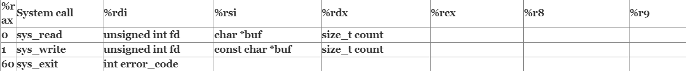

1 hello.asm과 strlen.asm 비교
====

hello.asm
```x86asm
global    _start 
section   .text ;실제 실행할 코드가 들어가는 부분
_start:
    mov       rax, 1 ;rax에 1의 값을 넣음 
    mov       rdi, 1 ;rdi에 1의 값을 넣음
    mov       rsi, message ;rsi에 message의 값을 넣음
    mov       rdx, 13 ;rdx에 13값을 넣음
    syscall ;이제까지 넣은 값으로 시스템 콜을 한다.
    mov       rax, 60 ;rax에 1의 값을 넣음
    xor       rdi, rdi ;rdi와 rdi xor연산 -> 0값이 될 수 밖에 없음
    syscall 

    section   .data ;변수가 들어가는 부분
message:
    db        "Hello, World", 10 ;messasge라는 변수 이름을 db(1byte)변수로 선언하고 다음의 값들을 초기화. 10은 개행문자

```

[syscall table for 64bit](https://crasy.tistory.com/75)


- 이 표를 보면 rax가 1일때는 write의 기능을 제공한다. 
- 이때 rdi에 unsignd int fd값이 들어가게 되는데 1일 경우 출력을 0일경우 입력을 의미한다.
- rsi에는 출력할 문자를 입력받고
- rdx에는 그 출력할 문자의 크기를 입력받는다.

따라서 위의 코드와 같은 경우는 rax에 1을 넣었기 때문에 syscall을 하게 될때 write의 기능을 사용하겠다는 의미이고, rdi에 1을 넣어 기본 출력으로 rsi값을 rdx만큼 출력하겠다는 의미이다. 이후 rax에 60을 넣어 exit을 사용하겠다는 의미이고 rdi에 0이 들어가 안전하게 종료하겠다는 것을 의미한다.


---
strlen.asm
```x86asm
BITS 64

section .text 
global _start

strlen: ;strlen이라는 함수를 만듬
    mov rax,0                  
.looplabel:
    cmp byte [rdi],0  ; rdi에 byte크기만큼 해당하는 값이 0과 비교 
    je  .end          ; 만약 비교한 값이 같다면 .end로 이동
    inc rdi           ; 아니라면 rdi의 값을 1 증가시킨다
    inc rax           ; rax의 값을 1증가시킨다       
    jmp .looplabel    ; .looplabel로 이동한다       
.end:
    ret               ; 리턴한다 값은 rax저장     
    
_start:
    mov   rdi, msg              
    call  strlen ;strlen함수를 부른다
    add   al, '0'  ;al에 '0'을 더한다             
    mov  [len],al  ;len에 al값을 넣는다          
    mov   rax, 1           
    mov   rdi, 1          
    mov   rsi, len       
    mov   rdx, 2        
    syscall           
    mov   rax, 60    
    mov   rdi, 0    
    syscall        

section .data
    msg db "hello",0xA,0        
    len db 0,0xA 
```

위의 코드 같은 경우 rdi에 msg값을 넣고 strlen함수를 실행하게 된다. strlen함수에서는 rdi에 한바이트 크기만 0과 비교를 하게 된다. 즉 처음에는 'h'를 비교하게 될 것이다. je는 if(a==b)와 같은 의미를 가진다. 따라서 byte [rdi]이 0과 같을때까지 .looplabel을 실행하게 된다. 한번 실행이 될때마다 rax의 값이 1증가하고 rdi의 값고 1증가하게 된다. msg는 'h','e','l','l','o','0xA',0이므로 0을 만날때까지 6번이 반복하게 되고 rax(=al)에는 6이 저장되고 .end를 만나 ret하게 된다. 그리고 hello.asm과 마찬가지로 len를 출력하게 되므로 6이 출력이 되는 것이다.