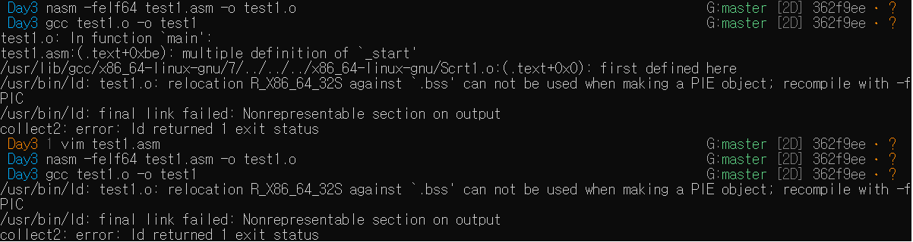
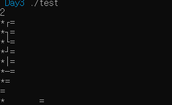

# 구구단 만들기


내가 아직 어셈블리어에 익숙하지 않은 것 같아서 익숙해지기 위해서 어셈블리어로 구구단을 출력해보면서 익혀보기로 했다. ~~하지만 실패~~  
어떤 블로그에서 다음과 같은 코드를 봤다.
<details>  
<summary>참고한 코드</summary>

```x86asm
global main, _start

section .bss
buffer:     resb 128
res:        resb 10
increase:   resb 10

section .data
fmt:        db '%d', 0
equal:      db '=', 0
mul:        db '*', 0
end:        db 10, 0

section .text
        extern printf
        extern scanf
        extern exit

multi:
        push rbp
        mov rbp, rsp
        xor rax, rax
        xor rbx, rbx
        inc rax
        inc rbx
_loop:
        mov rcx, 9
        cmp rbx, rcx
                jg _end
        mov rax, rbx
        mov rdi, [buffer]
        mul rdi
        mov [increase], bx
        mov [res], rax
        call print_line

        inc rbx
        jmp _loop

_end:
        leave
        ret

print_line:
        push rbp
        mov rbp, rsp
        mov rsi, [buffer]
        mov rdi, fmt
        mov rax, 0
        call printf
        mov rdi, mul
        mov rax, 0
        call printf
        mov rdi, equal
        mov rax, 0
        call printf 
        mov rsi, [res]
        mov rdi, fmt 
        mov rax, 0
        call printf
        mov rdi, end
        mov rax, 0
        call printf
        leave
        ret

main:
_start:
        push rbp
        mov rsi, buffer
        mov rdi, fmt
        mov rax, 0
        call scanf
        call multi
        call exit
        pop rbp
        ret
```


</details>
원래 이 코드를 실행시켜보고 싶었지만 c표준 라이브러리를 사용하기 위해서는 컴파일을 기존에 배운 방식이 아닌 다른 방식으로 해야 사용할 수 있다. 그래서 도전 해보았지만 컴파일이 잘 안된다. 그래서 일단 참고만하여 작성해보았다.
 



다음은 내가 구상해본 코드이다.
<details>
<summary>코드</summary>

```x86asm
global _start

section .bss
input:     resb 10
result:        resb 10
increase:   resb 10

section .data
equal:      db '=', 0
multiple:   db '*', 0
end:        db 10, 0

section .text

printf: 
        mov rdx, 2
        mov rdi, 1
        mov rax, 1
        syscall
        ret

multi:
        xor rax, rax
        xor rbx, rbx
        inc rax
        inc rbx
.loop:
        mov rcx, 9
        cmp rbx, rcx
                jg .end
        mov rax, rbx
        mov rdi, [input]
        mul rdi
        mov [increase], rbx
        mov [result], rax
        call print_line

        inc rbx
        jmp .loop

.end:
        ret

print_line:
        mov rsi, [input]
        call printf
        mov rsi, multiple
        call printf
        mov rsi, increase
        call printf
        mov rsi, equal
        call printf 
        mov rsi, [result]
        call printf
        mov rsi, end
        call printf
        ret

_start:
        mov rsi, input
        mov rax, rax
        mov rdi, rax     
        mov rdx, 2   
        syscall

        call multi
        
        mov rax, 60
        mov rdi, 0
        syscall

```
</details>

이렇게 코드를 작성하게 될 경우 문제가 발생하게 된다.


이 문제는 출력을 하게 될때 숫자들이 0~9까지의 아스키코드값으로 출력이 안된 결과인 것 같다. 그리고 입력받은 숫자가 아스키코드값으로 되어 있어 연산이 될때 정상적으로 연산이 안된 문제도 있다는 것을 발견했다.

그래서 다음과 같은 코드를 짜보았다. 원래 원하는 결과는 2를 입력했을 경우 4가 나오는 것이었는데, 아무런 출력을 하지않는다...~~실패의 원인~~
<details>
<summary>코드</summary>

```x86asm
global _start    
section .bss
    buffer:     resb 5
    res:        resb 2
    increase:   resb 2

section .text

printf:
mov rdi, 1
mov rax, 1
mov rdx, 2
syscall
ret

_start:

mov rsi, buffer
mov rax, rax
mov rdi, rax
mov rdx, 4
syscall

mov cl, [buffer]
movzx rdi, cl
sub rdi, 0x30

mov rax, 2
mul rdi
 
add rax,0x30
mov rsi, rax
call printf

mov rax, 60
mov rdi, 0
syscall

section .data
equal:      db '= ', 0
multipl:    db '* ', 0
end :       db 10, 0
```
</details>

만약 위의 문제를 해결을 했다는 가정하에 출력방식을 생각해보았다.

- 먼저 10이하의 결과값이 출력이 될때에는 값에 0x30을 더하여서 출력을 한다. 
- 만약 10 이상의 값이 나오게 된다면 스택에 수의 맨 오른쪽 값부터 하나씩 집어 넣는다. (ex 123이면 3 2 1순으로)
- 스택의 가장 윗값을 pop하여 0x30을 더하여서 출력한다.
- 스택에 남는 것이 없다면 널 문자를 출력한다.

이런 방식으로 출력하게 된다면 9 이상의 숫자도 출력할 수 있지 않을까 생각해본다.


---
해결해야 하는 것 및 궁금했던 것

1. extern을 사용하여 c표준 라이브러리를 참조했을 경우 컴파일 하는 방법
2. 입력을 받았을 때 입력 받은 값을(문자열로 입력이 받아지므로) 숫자로 바꾸고 다시 숫자로 출력하는 방법
3. 위와는 완전히 다른 궁금증인데 gdb를 이용하여 어떤함수의 주소값을 알아내어 ret에 그 함수 주소값을 보내면 어떻게 될지