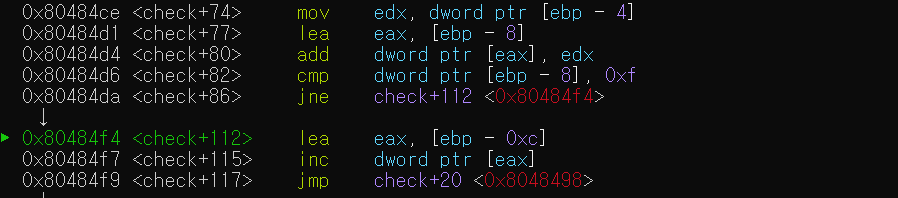
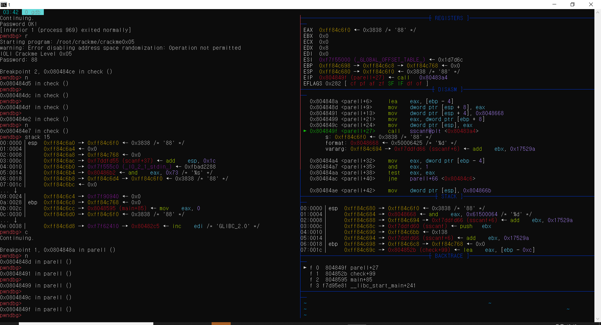

# crakme0x04 분석 결과

처음 값을 넣고 리버싱을 하면서 어떻게 흘러가는지 확인을 해보았다.

- main함수에서 값을 %s 문자열로 입력을 받는다.
- check함수를 실행한다.
- 문자열의 길이를 구한다.
- 문자를 한 바이트씩 쪼개서 그 한바이트에 대해서 최대 문자열 길이 만큼 반복한다.(ex 1a2b3 -> 1, a, 2, b, 3)
- 0xf와 ebp-8의 값을 비교한다.

여기까지 확인했을 때 어 뭔가 ebp의 값이 15가 되면 되겠다는 생각이 들었다. 그리고 한바이트씩 쪼개는거 보면 뭔가 숫자로 각 자릿수들의 숫자의 합이 15가 되면 되겠다는 생각을 해보아서 실행 했더니 맞았다.

그리고 더 자세한 원리를 알아 보았다. 일단 스택이 다음과 같은 구조를 지니고 있다는 것을 알면 이해가 더 쉽다. 그리고 입력값은 12345이다.
|스택|
|:---:|
|esp|
|ebp-4와 같은 값을 가지고 있다.(esp+8)|
|-|
|1byte로 쪼갠 수(ex 0x31, 0x63)(ebp-0xd)|
|반복한 횟수(ex 0x1, 0x2, ...)(ebp-0xc)|
|총 저장된 값(ebp-8)|
|ssanf를 했을 때 값(ebp-4)|
|ebp|
|-|
|입력받은 값(ex 12345)(ebp+8)|
||
문자열의 길이을 확인하는 중. 다음 그림에서 eax와 ebp-0xc와 비교 하여 eax가 크거나 같다면 check 119로이동(틀렸다고 출력함) 

call strlen@plt실행 결과 eax가 0x5로 바뀜(나머지는 크게 사용되지 않음)

이 과정은 문자열을 하나씩 쪼개는 과정   
궁금한점 1. check 39번째에서 add부분. eax는 현재 스택에서 반복한 횟수 부분의 값을 가지고 있다.  그런데 연산 결과가 문자열에서 반복한 횟수 만큼 앞의 문자에서 시작한다. 예를 들면 원래 12345 인데 3번을 반복했으면 45가 eax에 저장인 된다. 마치 포인터에서 +같은 느낌

궁금한점 2. 다음사진은 check 63실행이후 스택부분이다. 사진에서 eax-3라고 적힌 부분. ebp - 0xd는 어디를 의미하는 거고 왜 저렇게 쓰여있을까? (이걸 작성하면서 해결 했다. 이유는 0x31만 보기 위해서 그리고 리틀 어쩌고로 저장이 되기때문)

궁금한점 3. 다음 사진은 check 66 실행후 레지스터의 값(12345를 입력했을때 한번 돌고 2일때 실행). 이때 왜 eax의 값이 저렇게 되는지. (알아낸 것은 0x이후 처음은 반복 횟수이고 아마 a78, 7a8 과 같은 값을 오답으로 처리하기 위해서 인것 같은데 잘 모르겠다.)

한 바이트씩 쪼개면 sscanf함수를 부른다. 이때 포멧이 %d이므로 숫자가 아닌 경우 입력값은 무시된다.

다음은 함수 실행결과 eax가 0x31에서 0x1로 바뀐 것을 확인 가능 

또 스택을 확인해 보면 ebp-4부분과 esp+8부분도 바뀐 것을 확인 할 수 있다.

마지막으로 값을 rbp-8에있던 값에 더하고 0xf와 비교한다. 만약 맞다면 맞고 출력 아니라면 반복.

결론 : 답은 중간에 문자열이 섞이면 안되고 숫자로 시작해야하며 각 자릿수의 조합이 15가 되어야함. 만약 15가 됐다면 그 뒤에는 무엇이 오든 상관 없음

ex)   
12345(아무거나와도 된다.) (o)   
a12345 (x)  
7a8 (x)

crackme0x05를 하면서 하나 더 발견!

# crackme0x05 분석 결과

parell이라는 함수를 만나기 전까지는 crankme0x04와 과장이 완전히 동일하다. 대신 비교하는 숫자는 0x10과 비교를 하고 만약 0x10과 같다면 parell함수를 호출 하게 된다. parell에서 eax에 ebp+8값을 넣고 sscanf를 하게 된다.

그러면 스택에 ebp-4와 esp+8의 값이 바뀐것을 확인 할 수 있고 저 숫자를 10진수로 바꾸면 원래 입력된 값이 나온다. 근데 만약 문자열을 만나게 된다면 문자열 만나기 전 숫자까지만 입력이 된다 (ex 58b33a이면 58만 저장)

이후 parell 35에서 and eax, 1을 하게 된다면 짝수는 0이 될 것이고 홀수는 1이 될 것이다. 그 상태에서 test eax eax를 하면 zero flag가 짝수일때만 True가 된다. 따라서 ZF가 true이면 parell 40을 스킵하여 암호가 맞다는 것을 출력하게 되고 아니라면 parell+66으로 가게 되어 틀렸다고 출력을 한다.  

결론 : 답은 중간에 문자열이 섞이면 안되고 숫자로 시작해야하며 각 자릿수의 조합이 16가 되어야함. 만약 16이 됐다면 그 뒤에는 무엇이 오든 상관 없음. 그리고 문자열이 나오기전까지의 숫자가 짝수이어야 함.

ex)   
88(아무거나 해도 상관없다.) (o)
a88(x)
781(x)

# crackme4,5 암호가 될 수 있는 거 추가

다음그림은 crackme0x05에서 8a8을 입력하고 check에서 2번째 루프 즉 'a'를 sscanf에 넣게 될때 이다. 포멧이 %d이므로 결과 값은 무시가 된다.

그래서 이런 결과가 나오는데 문자를 만나게 되면 ebp-4와 esp+8의 값이 변하지가 않는 것을 확인 할 수 있다.

따라서 crackme0x05에서는 8a8의 결과는 check에서 'a'를 할때 이전의 결과인 8이 ebp-8에 더해져서 16이 충족되고 parell에서는 문자 a전인 8까지만 입력이 되고 8은 짝수 이므로 충족이 된다.

결론 : 중간에 문자열이 왔을 때 암호로 충족이 가능하게 할 수 있다. 다양한 조합을 만들 수 있다. 단, 처음 숫자는 이전 규칙과 동일하게 숫자먼저 나와야 한다.   

crackme0x04에서는 1(아무거나 14개 이상)을 하면 정답이고 마찬가지로 32a8도 정답이다.

crackme0x05에서는 2(아무거나 8개 이상)을 하면 정답이고 마찬가지로 24av28도 정답이다.

