# bomb 노란선 해체

i func으로 확인한 결과 봐야겠다 싶은 것은 main, yellow, yellow_preflight일 듯 싶어서 
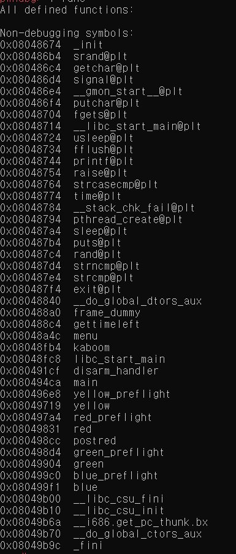

다음과 같이 브레이크포인트를 주었다.
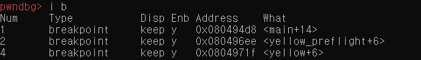

main의 함수를 보니 폭탄을 출력하고 자르고싶은 선을 숫자로 입력받는다. yellow의 같은 경우 1을 입력 받으면 call yellow를 하도록 프로그래밍되어 있다.
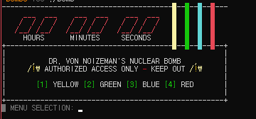

yellow부분에서 call yellow_preflight하게 되는데 이 함수는 노란줄을 해체하기 위한 암호를 입력받는 함수이다. 다음을 보면 buffer라는 곳에 fgets로 입력을 받아 저장하는 것을 알 수 있다.

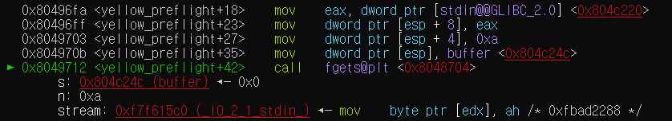

이후 buffer에 저장된 값을 한 바이트씩 비교를 하는 과정을 거친다. 처음과 같은 경우 0x38 입력받은 값 중 제일 앞자리와 비교를하게 되고 만약 다르면 yellow+99를 하게 된다.
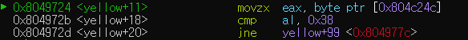 

yellow+99같은 경우는 실패했다는 것을 출력하는 부분이다.
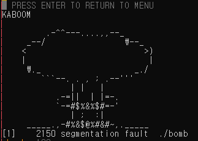

그러면 0x38과 같다면 어디로 갈지 알아보고 싶어 ZF를 강제로 참으로 만들어 보았다. 다음과 같이 입력하면 ZF를 참으로 만들 수 있다.
```
set $ZF= 6    
set $eflags |= (1 << $ZF)
```
참이었을 경우 buffer+1에 있는 자료, 즉 입력한 숫자중 두번째 숫자와 0x34와 비교한 코드가 나온다. 
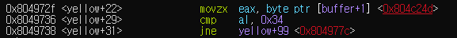


계속 해서 ZF를 참으로 만들어가면서 진행해 보았다.

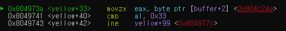
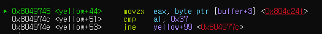
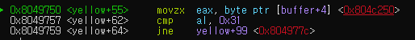
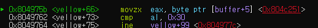
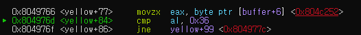
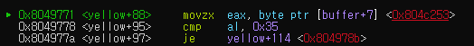

맨 마지막 숫자와 비교후 je를 만나게 된다. 만약 저 문장이 참이면 다음과 같은 메세지를 출력하게 된다.

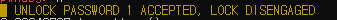

따라서 암호는 4371065가 되겠다.